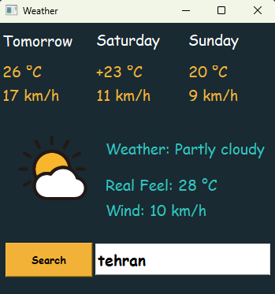

# PyDeploy By:
### AmirHossein Dehmovlaei

---
## simple weather App
This program uses a web service to receive weather information for the current day and the next three days

## Run
1. clone the project
2. install dependencies:
```bash
pip install -r requirements.txt
```
3. from project root directory runs:
```bash
python weather.py
```
